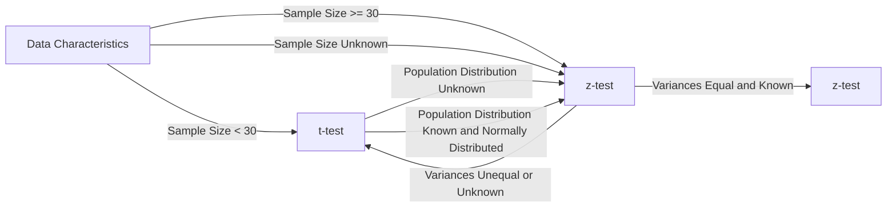

# H3

Discrete random variable -> een variabele die een beperkt aantal waardes kan aannemen
Continuous random variable -> een variabele die een oneindig aantal waardes kan aannemen

- Kans type 1 fout = alpha

## Central Limit Theorem

- De som van een groot aantal onafhankelijke random variabelen is ongeveer normaal verdeeld
- Hoe groter de steekproef, hoe beter de benadering

- Hier is de sigma ALTIJD bij sample = **standaardafwijking / sqrt(n)**

### The normal distribution

#### Plotting density function of a normal distribution

```py
# STANDAARD NORMAL DISTRIBUTIE -> mean = 0, std = 1
# Take 100 values for the X-axis, between -4 and 4, evenly spaced
x = np.linspace(-4, +4, num=101)
y = stats.norm.cdf(x, m, s)
# Plot the probability density function (pdf) for these X-values
plt.plot(x, y)

# voor een normale distributie met mean = 5 en std = 1.5 -> de vorm van de grafiek is identiek gewoon op andere schaal
m = 5    # Gemiddelde mean van POPULATIE!!
s = 1.5  # Standaardafwijking 
# als standaard deviation onbekend is voor de sample:
  #std_error = s / np.sqrt(n)  NIET VERGETEN DOEN AUB
x = np.linspace(m - 4 * s, m + 4 * s, num=201)
plt.plot(x, stats.norm.pdf(x, loc=m, scale=s))

y = stats.norm.cdf(x, m, s)
plt.plot(x, y)


```

#### Plotting histogram of a sample with theoretical probability density

```py
# Histogram of the sample
plt.hist(sample, bins=20, density=True, label="Histogram of the sample")
# of
sns.distplot(sample, kde=True, label="Histogram of the sample")

```

#### Probability distribution in the normal distribution

**Student $t$-distribution in Python**  
Import scipy.stats  
For a $t$-distribution with df degrees of freedom: (df = degrees of freedom)

| **Function**           | **Purpose**                                                 |
| ---------------------- | ----------------------------------------------------------- |
| stats.t.pdf(x, df=d)   | Geeft de kansdichtheid (PDF) op punt xx. Dit toont hoe waarschijnlijk het is dat een waarde exact xx is.                                |
| stats.t.cdf(x, df=d)   | Geeft de cumulatieve kans (CDF) tot en met punt xx. Dit toont de kans dat een waarde kleiner dan of gelijk aan xx is.                           |
| stats.t.sf(x, df=d)    | Geeft de overlevingskans (SF), oftewel 1−CDF(x)1−CDF(x). Dit toont de kans dat een waarde groter dan xx is                           |
| stats.t.isf(1-p, df=d) | Geeft het punt xx waarvoor de overlevingskans gelijk is aan 1−p1−p. Dit toont de waarde onder de normale verdeling waarvoor pp procent van de waarden kleiner zijn. |

**Normal distribution in Python**
**Python functions**

Import scipy.stats  
For a normal distribution with mean m and standard deviation s:

| **Function**                        | **Purpose**                                             |
| ----------------------------------- | ------------------------------------------------------- |
| stats.norm.pdf(x, loc=m, scale=s)   | Kansdichtheidsfunctie (PDF)                             |
| stats.norm.cdf(x, loc=m, scale=s)   | Cumulatieve Distributiefunctie (CDF)                        |
| stats.norm.sf(x, loc=m, scale=s)    | Survival Function (SF)                        |
| stats.norm.isf(1-p, loc=m, scale=s) | Inverse Survival Function (ISF) |

#### More examples of probability calculations
```py

# Parameters van de normale verdeling
mean = 5      # Gemiddelde reactietijd
std_dev = 1.5 # Standaarddeviatie

# 1. Kans dat Superman reageert in minder dan 4 ms
prob_less_than_4 = stats.norm.cdf(4, loc=mean, scale=std_dev)

# 2. Kans dat Superman reageert in minder dan 7 ms
prob_less_than_7 = stats.norm.cdf(7, loc=mean, scale=std_dev)

# 4. Kans dat Superman reageert tussen 2 en 6,5 ms
prob_between_2_and_6_5 = stats.norm.cdf(6.5, loc=mean, scale=std_dev) - stats.norm.cdf(2, loc=mean, scale=std_dev)
```
### confidence intervals

- confidence interval -large sample -> een interval waarin de parameter met een bepaalde kans ligt

```py
# Step 1.
m = 324.6      # Sample mean
s = 2.5      # Population standard deviation
n = 45      # Sample size
alpha = .05  # 1 - alpha is the confidence level

# Step 2.
z = stats.norm.isf(alpha/2)
print("z-score: %.5f" % z)

# Step 3.
lo = m - z * s / np.sqrt(n)
hi = m + z * s / np.sqrt(n)
print("Confidence interval: [%.4f, %.4f]" % (lo, hi))
```

- confidence interval -small sample -> students t test (**N KLEINER DAN 30!**)

```py
# Step 1.
m = 5.2      # Sample mean
s = 1.5      # Sample (!) standard deviation
n = 15       # Sample size
alpha = .05  # 1 - alpha is the confidence level

# Stap 2.
t = stats.t.isf(alpha/2, df = n - 1)
print("t-score: %.5f" % t)

# Stap 3.
lo = m - t * s / np.sqrt(n)
hi = m + t * s / np.sqrt(n)
print("Confidence interval: [%.4f, %.4f]" % (lo, hi))
```

---



Requirements z-test:

- Random sample
- Sample groot genoeg (n >= 30)
  - als normaal verdeeld is is sample size niet relevant
- normaal verdeeld
- populatie standaard deviatie is gekend

indien 1 van deze niet voldaan is gebruik je de t-test en deze normaal verdeeld is

### Central limit theorem
```py
mean = 23.3
sigma = 8.9
n = 60
samplemean = 25 # het geen dat je krijgt dus die x met platte streep erboven
# Bereken de standaardfout van het gemiddelde
std_error = sigma / (n ** 0.5)

# Bereken de Z-score
z_score = (samplemean - mean) / std_error

# Bereken de kans dat het gemiddelde gewicht onder 11 kg ligt
probability = stats.norm.cdf(z_score)

print(f"Kans dat het gemiddelde gewicht onder 11 kg ligt: {probability:.4f}")

```
## Z-test

### right-tailed

```py
## RIGHT TAIL Z-TEST
#Step 1: formulate the null and alternative hypotheses
#- H0: μ = 100
#- H1: μ > 100

#Step 2: specify the significance level
# Properties of the sample:
n = 50      # sample size
sm = 20.2  # sample mean
s = 0.4    # population standard deviation (assumed to be known)
a = 0.05    # significance level (chosen by the researcher)
m0 = 20.0    # hypothetical population mean (H0)

# Plotting the sample distribution
# Gauss-curve plot:
# X-values
dist_x = np.linspace(m0 - 4 * s/np.sqrt(n), m0 + 4 * s/np.sqrt(n), num=201)
# Y-values for the Gauss curve
dist_y = stats.norm.pdf(dist_x, m0, s/np.sqrt(n))
fig, dplot = plt.subplots(1, 1)
# Plot the Gauss-curve
dplot.plot(dist_x, dist_y)
# Show the hypothetical population mean with an orange line
dplot.axvline(m0, color="orange", lw=2)
# Show the sample mean with a red line
dplot.axvline(sm, color="red")

#Step 3: compute the test statistic (red line in the plot)
# Hier is dat 20.2

#Step 4:
## method 1
# Determine the $p$-value and reject $H_0$ if $p < \alpha$.
#The $p$-value is the probability, if the null hypothesis is true, to obtain
# a value for the test statistic that is at least as extreme as the
# observed value
p = stats.norm.sf(sm, loc=m0, scale=s/np.sqrt(n))
print("p-value: %.5f" % p)
if(p < a):
    print("Verwerp de nulhypothese (H0). Er is voldoende bewijs dat de het niet correct is.")
else:
    print("Verwerp de nulhypothese (H0) niet. Er is onvoldoende bewijs dat het niet correct is.")

## method 2
# An alternative method is to determine the critical region, i.e. the set of all values for the sample mean where $H_0$ may be rejected.
# The boundary of that area is called the critical value $g$. To the left of it you can't reject $H_0$ (acceptance region), to the right you can (critical region). The area of the acceptance region is $1 - \alpha$, the area of the critical region is $\alpha$.
g = stats.norm.isf(a, loc = m0, scale = s / np.sqrt(n))
print("Critical value g ≃ %.3f" % g)
if (sm < g):
    print("sample mean = %.3f < g = %.3f: do not reject H0" % (sm, g))
else:
    print("sample mean = %.3f > g = %.3f: reject H0" % (sm, g))


# Step 5
# We can conclude that if we assume that  $H_0$  is true, the probability to draw a sample from this population with this particular value for  $\bar{x}$  is very small indeed. With the chosen significance level, we can reject the null hypothesis.

```

### left-tailed

```py
## LEFT TAIL Z-TEST
#Step 1: formulate the null and alternative hypotheses
#- H0: μ = 100
#- H1: μ < 100

#Step 2: specify the significance level
# Properties of the sample:
n = 50      # sample size
sm = 19.94  # sample mean
s = 0.4    # population standard deviation (assumed to be known)
a = 0.05    # significance level (chosen by the researcher)
m0 = 20.0    # hypothetical population mean (H0)

# Plotting the sample distribution
# Gauss-curve plot:
# X-values
dist_x = np.linspace(m0 - 4 * s/np.sqrt(n), m0 + 4 * s/np.sqrt(n), num=201)
# Y-values for the Gauss curve
dist_y = stats.norm.pdf(dist_x, m0, s/np.sqrt(n))
fig, dplot = plt.subplots(1, 1)
# Plot the Gauss-curve
dplot.plot(dist_x, dist_y)
# Show the hypothetical population mean with an orange line
dplot.axvline(m0, color="orange", lw=2)
# Show the sample mean with a red line
dplot.axvline(sm, color="red")

#Step 3: compute the test statistic (red line in the plot)
# Hier is dat 19.94

#Step 4:
## method 1
# Determine the $p$-value and reject $H_0$ if $p < \alpha$.
#The $p$-value is the probability, if the null hypothesis is true, to obtain
#a value for the test statistic that is at least as extreme as the
# observed value
p = stats.norm.cdf(sm, loc=m0, scale=s/np.sqrt(n))
print("p-value: %.5f" % p)
if(p < a):
    print("Verwerp de nulhypothese (H0). Er is voldoende bewijs dat de het niet correct is.")
else:
    print("Verwerp de nulhypothese (H0) niet. Er is onvoldoende bewijs dat het niet correct is.")

## method 2
# An alternative method is to determine the critical region, i.e. the set of all values for the sample mean where $H_0$ may be rejected.
# The boundary of that area is called the critical value $g$. To the right of it you can't reject $H_0$ (acceptance region), to the left you can (critical region). The area of the acceptance region is $\alpha$, the area of the critical region is $1 - \alpha$.
g = stats.norm.isf(1-a, loc = m0, scale = s / np.sqrt(n))
print("Critical value g ≃ %.3f" % g)
if (sm > g):
    print("sample mean = %.3f > g = %.3f: do not reject H0" % (sm, g))
else:
    print("sample mean = %.3f < g = %.3f: reject H0" % (sm, g))


# Step 5
#  We can conclude that there is not enough evidence to reject the
#  null hypothesis.
```

### two-tailed
Wanneer we niet willen testen of het populatiegemiddelde groter of lager is dan een hypothetische waarde, maar alleen willen weten of het steekproefgemiddelde "dicht genoeg" bij die waarde ligt, kunnen we een tweezijdige $z$-test gebruiken.
```py
## TWo tailed Z-TEST
#Step 1: formulate the null and alternative hypotheses
#- H0: μ = 100
#- H1: μ != 100

#Step 2: specify the significance level
# Properties of the sample:
n = 50      # sample size
sm = 19.94  # sample mean
s = 0.4    # population standard deviation (assumed to be known)
a = 0.05    # significance level (chosen by the researcher)
m0 = 20.0    # hypothetical population mean (H0)


#Step 3: compute the test statistic (red line in the plot)
# Hier is dat 19.94

#Step 4:
## method 1
# Calculate the $p$-value and reject $H_0$ if $p < \alpha/2$ (why do we divide by 2?).
p = stats.norm.cdf(sm, loc=m0, scale=s/np.sqrt(n))
print("p-value: %.5f" % p)
if(p < a/2):
    print("Verwerp de nulhypothese (H0). Er is voldoende bewijs dat de het niet correct is.")
else:
    print("Verwerp de nulhypothese (H0) niet. Er is onvoldoende bewijs dat het niet correct is.")

## method 2
# In this case, we have two critical values: $g_1$ on the left of the mean and $g_2$ on the right. The acceptance region still has area $1-\alpha$ and the critical region has area $\alpha$.
g1 = stats.norm.isf(1-a/2, loc = m0, scale = s / np.sqrt(n))
g2 = stats.norm.isf(a/2, loc = m0, scale = s / np.sqrt(n))

print("Acceptance region [g1, g2] ≃ [%.3f, %.3f]" % (g1,g2))
if (g1 < sm and sm < g2):
    print("Sample mean = %.3f is inside acceptance region: do not reject H0" % sm)
else:
    print("Sample mean = %.3f is outside acceptance region: reject H0" % sm)

# Plotting the sample distribution
# Gauss-curve
# X-values
dist_x = np.linspace(m0 - 4 * s/np.sqrt(n), m0 + 4 * s/np.sqrt(n), num=201)
# Y-values
dist_y = stats.norm.pdf(dist_x, loc=m0, scale=s/np.sqrt(n))
fig, dplot = plt.subplots(1, 1)
# Plot
dplot.plot(dist_x, dist_y)
# Hypothetical population mean in orange
dplot.axvline(m0, color="orange", lw=2)
# Sample mean in red
dplot.axvline(sm, color="red")
acc_x = np.linspace(g1, g2, num=101)
acc_y = stats.norm.pdf(acc_x, loc=m0, scale=s/np.sqrt(n))
# Fill the acceptance region in light blue
dplot.fill_between(acc_x, 0, acc_y, color='lightblue')

# Step 5
#  So if we do not make a priori statement whether the actual population mean is either smaller or larger, then the obtained sample mean turns out to be sufficiently probable. We cannot rule out a random sampling error. Or, in other words, we *cannot* reject the null hypothesis here.
```

## t-test

### right-tailed

```py
# Right tailed t test
#Step 1: formulate the null and alternative hypotheses
#- H0: μ = 100
#- H1: μ > 100

#Step 2: specify the significance level
# Properties of the sample:
n = 50      # sample size
sm = 20.2  # sample mean
s = 0.4    # sample standard deviation (assumed to be known)
a = 0.05    # significance level (chosen by the researcher)
m0 = 20.0    # hypothetical population mean (H0)

# Plotting the sample distribution
# Gauss-curve plot:
# X-values
dist_x = np.linspace(m0 - 4 * s/np.sqrt(n), m0 + 4 * s/np.sqrt(n), num=201)
# Y-values for the Gauss curve
dist_y = stats.t.pdf(dist_x, loc = m0,scale = s/np.sqrt(n), df = n-1)
fig, dplot = plt.subplots(1, 1)
# Plot the Gauss-curve
dplot.plot(dist_x, dist_y)
# Show the hypothetical population mean with an orange line
dplot.axvline(m0, color="orange", lw=2)
# Show the sample mean with a red line
dplot.axvline(sm, color="red")

#Step 3: compute the test statistic (red line in the plot)
# Hier is dat: VUL IN

#Step 4:
## method 1
# Determine the $p$-value and reject $H_0$ if $p < \alpha$.
#The $p$-value is the probability, if the null hypothesis is true, to obtain
# a value for the test statistic that is at least as extreme as the
# observed value
p = stats.t.sf(sm, loc=m0, scale=s/np.sqrt(n), df=n-1)
print("p-value: %.5f" % p)
if(p < a):
    print("Verwerp de nulhypothese (H0). Er is voldoende bewijs dat de het niet correct is.")
else:
    print("Verwerp de nulhypothese (H0) niet. Er is onvoldoende bewijs dat het niet correct is.")

## method 2
# An alternative method is to determine the critical region, i.e. the set of all values for the sample mean where $H_0$ may be rejected.
# The boundary of that area is called the critical value $g$. To the left of it you can't reject $H_0$ (acceptance region), to the right you can (critical region). The area of the acceptance region is $1 - \alpha$, the area of the critical region is $\alpha$.
g = stats.t.isf(a, loc = m0, scale = s / np.sqrt(n), df = n-1)
print("Critical value g ≃ %.3f" % g)
if (sm < g):
    print("sample mean = %.3f < g = %.3f: do not reject H0" % (sm, g))
else:
    print("sample mean = %.3f > g = %.3f: reject H0" % (sm, g))


# Step 5
# We can conclude that if we assume that  $H_0$  is true, the probability to draw a sample from this population with this particular value for  $\bar{x}$  is very small indeed. With the chosen significance level, we can reject the null hypothesis.

```

### left-tailed
```py
## LEFT TAIL t-TEST
#Step 1: formulate the null and alternative hypotheses
#- H0: μ = 100
#- H1: μ < 100

#Step 2: specify the significance level
# Properties of the sample:
n = 50      # sample size
sm = 19.94  # sample mean
s = 0.4    # sample standard deviation (assumed to be known)
a = 0.05    # significance level (chosen by the researcher)
m0 = 20.0    # hypothetical population mean (H0)

# Plotting the sample distribution
# Gauss-curve plot:
# X-values
dist_x = np.linspace(m0 - 4 * s/np.sqrt(n), m0 + 4 * s/np.sqrt(n), num=201)
# Y-values for the Gauss curve
dist_y = stats.t.pdf(dist_x, loc=  m0, scale= s/np.sqrt(n), df = n-1)
fig, dplot = plt.subplots(1, 1)
# Plot the Gauss-curve
dplot.plot(dist_x, dist_y)
# Show the hypothetical population mean with an orange line
dplot.axvline(m0, color="orange", lw=2)
# Show the sample mean with a red line
dplot.axvline(sm, color="red")

#Step 3: compute the test statistic (red line in the plot)
# Hier is dat 19.94

#Step 4:
## method 1
# Determine the $p$-value and reject $H_0$ if $p < \alpha$.
#The $p$-value is the probability, if the null hypothesis is true, to obtain
#a value for the test statistic that is at least as extreme as the
# observed value
p = stats.t.cdf(sm, loc=m0, scale=s/np.sqrt(n), df=n-1)
print("p-value: %.5f" % p)
if(p < a):
    print("Verwerp de nulhypothese (H0). Er is voldoende bewijs dat de het niet correct is.")
else:
    print("Verwerp de nulhypothese (H0) niet. Er is onvoldoende bewijs dat het niet correct is.")
## method 2
# An alternative method is to determine the critical region, i.e. the set of all values for the sample mean where $H_0$ may be rejected.
# The boundary of that area is called the critical value $g$. To the right of it you can't reject $H_0$ (acceptance region), to the left you can (critical region). The area of the acceptance region is $\alpha$, the area of the critical region is $1 - \alpha$.
g = stats.t.isf(1-a, loc = m0, scale = s / np.sqrt(n), df=n-1)
print("Critical value g ≃ %.3f" % g)
if (sm > g):
    print("sample mean = %.3f > g = %.3f: do not reject H0" % (sm, g))
else:
    print("sample mean = %.3f < g = %.3f: reject H0" % (sm, g))


# Step 5
#  We can conclude that there is not enough evidence to reject the
#  null hypothesis.

```

### two-tailed
```py
## TWo tailed Z-TEST
#Step 1: formulate the null and alternative hypotheses
#- H0: μ = 100
#- H1: μ != 100

#Step 2: specify the significance level
# Properties of the sample:
n = 50      # sample size
sm = 19.94  # sample mean
s = 0.4    # sample standard deviation (assumed to be known)
a = 0.05    # significance level (chosen by the researcher)
m0 = 20.0    # hypothetical population mean (H0)


#Step 3: compute the test statistic (red line in the plot)
# Hier is dat 19.94

#Step 4:
## method 1
# Calculate the $p$-value and reject $H_0$ if $p < \alpha/2$ (why do we divide by 2?).
p = stats.t.cdf(sm, loc=m0, scale=s/np.sqrt(n), df=n-1)
print("p-value: %.5f" % p)
if(p < a/2):
    print("Verwerp de nulhypothese (H0). Er is voldoende bewijs dat de het niet correct is.")
else:
    print("Verwerp de nulhypothese (H0) niet. Er is onvoldoende bewijs dat het niet correct is.")

## method 2
# In this case, we have two critical values: $g_1$ on the left of the mean and $g_2$ on the right. The acceptance region still has area $1-\alpha$ and the critical region has area $\alpha$.
g1 = stats.t.isf(1-a/2, loc = m0, scale = s / np.sqrt(n), df = n-1)
g2 = stats.t.isf(a/2, loc = m0, scale = s / np.sqrt(n), df = n-1)

print("Acceptance region [g1, g2] ≃ [%.3f, %.3f]" % (g1,g2))
if (g1 < sm and sm < g2):
    print("Sample mean = %.3f is inside acceptance region: do not reject H0" % sm)
else:
    print("Sample mean = %.3f is outside acceptance region: reject H0" % sm)

# Plotting the sample distribution
# Gauss-curve
# X-values
dist_x = np.linspace(m0 - 4 * s/np.sqrt(n), m0 + 4 * s/np.sqrt(n), num=201)
# Y-values
dist_y = stats.t.pdf(dist_x, loc=m0, scale=s/np.sqrt(n), df=n-1)
fig, dplot = plt.subplots(1, 1)
# Plot
dplot.plot(dist_x, dist_y)
# Hypothetical population mean in orange
dplot.axvline(m0, color="orange", lw=2)
# Sample mean in red
dplot.axvline(sm, color="red")
acc_x = np.linspace(g1, g2, num=101)
acc_y = stats.t.pdf(acc_x, loc=m0, scale=s/np.sqrt(n),  df=n-1)
# Fill the acceptance region in light blue
dplot.fill_between(acc_x, 0, acc_y, color='lightblue')

# Step 5
#  So if we do not make a priori statement whether the actual population mean is either smaller or larger, then the obtained sample mean turns out to be sufficiently probable. We cannot rule out a random sampling error. Or, in other words, we *cannot* reject the null hypothesis here.
```
#### Gebruik van de functie ttest_1samp
SciPy biedt een functie ttest_1samp() die je in staat stelt om een two-tailed t-test uit te voeren op een verzameling waarnemingen:
```py
pulses = [48, 52, 59, 45, 57, 52, 44, 58, 56, 44, 63, 50]
alpha = 0.05
m0 = 80

t_stat, p_val = stats.ttest_1samp(alpha=pulses, popmean=m0, alternative='less')
print("Sample mean        : %.3f" % np.mean(pulses))
print("t-score            : %.3f" % t_stat)
print(f"p-value           : {p_val}")
```
SciPy biedt een functie ttest_1samp() die je in staat stelt om een two-tailed t-test uit te voeren op een verzameling waarnemingen:


